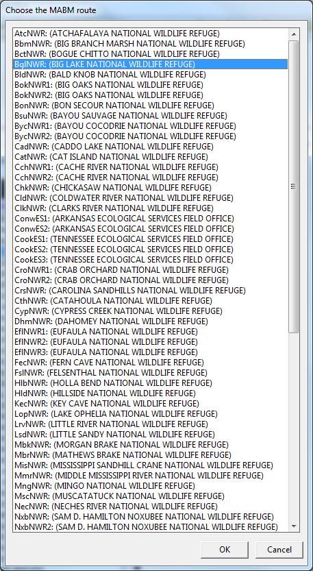
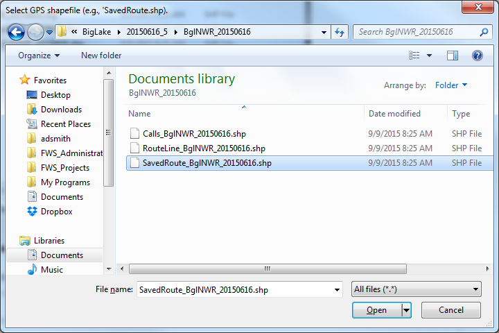

---
output:
  md_document:
    variant: markdown_github
---

[](https://travis-ci.org/adamdsmith/MABM)

<!-- README.md is generated from README.Rmd. Please edit that file -->

```{r, echo = FALSE}
knitr::opts_chunk$set(
  collapse = TRUE,
  comment = "#>",
  fig.path = "README-",
  message = FALSE)

library(MABM)
```

# USFWS Disclaimer
This United States Fish & Wildlife Service (USFWS) code is provided on an "as is" basis and the user assumes responsibility for its use.  USFWS has relinquished control of the information and no longer has responsibility to protect the integrity , confidentiality, or availability of the information.  Any reference to specific commercial products, processes, or services by service mark, trademark, manufacturer, or otherwise, does not constitute or imply their endorsement, recomendation or favoring by USFWS.  The USFWS seal and logo shall not be used in any manner to imply endorsement of any commercial product or activity by USFWS or the United States Government. 

# MABM (Mobile Acoustical Bat Monitoring)

This package contains functions for the creation, visualization, and quality assurance and control of spatial data associated with the USFWS Mobile Acoustical Bat Monitoring (MABM) program.

## Installing MABM

The MABM package requires you to have [R](https://www.r-project.org/) (>= 3.2.1) installed on your computer as well as [Rtools](https://cran.r-project.org/bin/windows/Rtools/).  Both will require administrative priveleges but the installation of packages after this initial install will not.

With R and Rtools installed, it's simple to install and load the MABM package to access its functionality.

```
# If devtools package is not installed
install.packages("devtools", dependencies = TRUE)

# Now load MABM
library("MABM")
```

## Using MABM

Basic operations are illustrated below.  For details on the arguments and options available in each function, see their associated help files: `?MABM_route` or `?plot_MABM_route`.

### Georeferencing bat detections

Typically the `MABM_route` function will be used to join an Excel spreadsheet of bat detection classifications created by Bat Call Identification ([BCID](http://www.batcallid.com)) with a text file of GPS fixes collected simultaneously.  In short, the function georeferences bat calls recorded along the route and prepares a *.csv file of georeferenced bat call classifications for import in the the MABM program Access database.  In addition to the *.csv file for database import, the function creates three ESRI shapefiles for detailed QA/QC of the bat survey route: a point shapefile of the GPS log, a route (line) shapefile that connects all GPS fixes chronologically into a single shape, and a point shapefile of each georeferenced bat detection. Finally, the default settings look within the selected directory for [Anabat](http://www.titley-scientific.com/us/index.php/anabat-bat-detector) audio files that have been generated by [CF Read](http://www.titley-scientific.com/us/index.php/software_firmware) and move those files not classified by BCID (and thus suspected as noise based on user settings in CF Read) into a separate subdirectory.

This is the output produced when using the default options and can be accomplished by calling the function with no listed arguments:

```{r MABM_route, eval=FALSE}
MABM_route()
```

First a dialog box opens that asks the user to specify the MABM route from which the data were collected (NOTE: some "locations" have multiple routes, so choose wisely).  In this example, we select Big Lake NWR.  The abbreviation for the selected route (e.g., "BglNWR") will be used (with the date of the survey) to name the resulting files.

  

A second dialog box prompts the user to specify the Microsoft Excel file produced by the Bat Call Identification software.  Note that each call to `MABM_route` begins in the current working directory, so changing the working directory (using `setwd`, for example) may save a fair amount of file hierarchy navigation if you'll be repeatedly running the function.

  

By default, the function assumes the fixed width text file containing the logged GPS points is co-located with the BCID file and is called `gps.txt`.  If found, the user is notified that `gps.txt` was used as the GPS source.  If `gps.txt` is not found, the user is prompted by a third and final dialog box to identify the GPS text file.

  

Once these are selected, the function creates a new directory in the same folder as the BCID classification file that contains a comma-delimited (*.csv) text file that can be directly imported into the MABM Access database and three shapefiles as described above.  Suspected noise files are scrubbed (moved) to a new subdirectory called `scrubbed`; if no Anabat files or suspected noise files are detected in the directory, scrubbing is ignored.  The user is alerted of this activity in the R console:

  

### Visualizing the route and bat detections

With the survey route shapefiles created, the `plot_MABM_route` function allows the user to visualize the route and detections without the need to open an alternative GIS program.  We use [leaflet](http://rstudio.github.io/leaflet) to facilitate interactivity.

There is only a single argument the user is likely to specify --- how to define a "bad" GPS fix for a bat call detection (`badgps`).  By default, `plot_MABM_route` classifies as "bad" those bat detections without a GPS location within 5 seconds of the detection.

For the Big Lake route we georeferenced, we can visualize the route and bat detections using the default options with: 

```{r plot_MABM, eval=FALSE}
plot_MABM_route()
```

This will open a dialog box asking the user to locate the point shapefile created from the GPS log.  This should begin with "SavedRoute".

 

The location of the detection point shapefile (begins with "Calls") is inferred automatically based on the GPS point shapefile.  Thus it is assumed that shapefiles were created using the `MABM_route` function (or at least according to its conventions).

This produces an interactive plot of the route and bat detections (view an interactive version of this README **[here](http://rpubs.com/adamsmith_fws/MABM_readme)**.):

 

A choice of a terrain or aerial imagery basemap is available; aerial imagery has been toggled on in this example.

The route is shaded with a gradient indicating how much time (in minutes) has elapsed since the GPS acquired its first fix.  Large gaps in the route (e.g., due to GPS failure) should be apparent if they are present.  Clicking on a GPS point along the route provides some information regarding that point (e.g., date, time, elapsed time since survey start).

Bat detections are indicated by bat icons along the route.  Bat icons are colored based on their species classification from the software; these colors will *not* change from route to route so learning them may facilitate interpretation in future plots. Users can toggle the visibility of "good" and "bad" GPS fixes (as defined by the user; see `?plot_MABM_route`), using the layers control feature in the upper right corner of the map.  Clicking on a bat icon reveals some information about the detection (e.g., time, species, seconds from the nearest [in time] GPS fix).

### Comparing species classifications between BCID and [EchoClass](http://www.fws.gov/midwest/endangered/mammals/inba/surveys/pdf/EchoclassV3Instructions.pdf)

The `id_compare` function facilitates the comparison of bat call classification between EchoClass and BCID software applied to the same suite of Anabat call files. The function generates a spreadsheet containing the comparison, sorted by classification agreement.  See `?id_compare` for details.

### General scrubbing of Anabat audio files

The `scrub_noise` function can be used to separate Anabat audio files apparently devoid of bat calls (i.e., noise) from calls identified by BCID to contain a bat call (subject to the user's specifications in BCID).  This can be useful when only a few calls are adrift in a sea of numerous noise files.  The function works on BCID results applied to single or multiple nights.  See `?scrub_noise` for more details.
