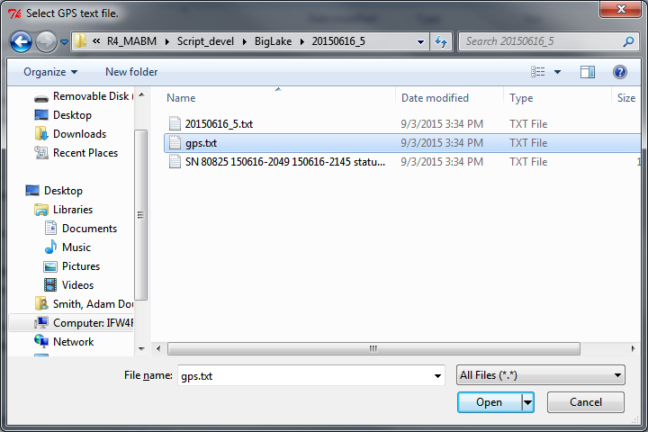

---
output:
#  html_document
  md_document:
    variant: markdown_github
---

```{r, echo = FALSE, message=FALSE}
knitr::opts_chunk$set(
    message=FALSE,
    collapse = TRUE
)

require(MABM)
```

# MABM (Mobile Acoustical Bat Monitoring)

This package contains functions for the creation, visualization, and quality assurance and control of spatial data associated with the USFWS Mobile Acoustical Bat Monitoring (MABM) program.

## Installing MABM

The MABM package requires you to have [R](https://www.r-project.org/) (>= 3.2.1) installed on your computer as well as [Rtools](https://cran.r-project.org/bin/windows/Rtools/).  Both will require administrative priveleges but the installation of packages after this initial install will not.

With R and Rtools installed, install and load the MABM package to access its functionality:

```
install.packages("devtools")
library("devtools")
install_github("adamdsmith/MABM")
library("MABM")
```

## Using MABM

Basic operations are illustrated below.  For details on the arguments and options available in each function, see their associated help files: `?MABM_route` or `?plot_MABM_route`.

### Georeferencing bat detections

Typically the `MABM_route` function will be used to join an Excel spreadsheet of bat detection classifications created by Bat Call Identification ([BCID](http://www.batcallid.com)) with a GPS fix collected simultaneously, in effect georeferencing identified calls, and prepare the bat call classifications for import in the the MABM program Access database.  In addition to the delimited text file for database import, the function creates three ESRI shapefiles for detailed QA/QC of the bat survey route (e.g., in ArcMap): a point shapefile of the GPS log, a route (line) shapefile that connects all GPS fixes chronologically into a single shape, and a point shapefile of each georeferenced bat detection.

This is the output produced when using the default options and can be accomplished by calling the function with no listed arguments:

```{r MABM_route, eval=FALSE}
MABM_route()
```

First a dialog box opens that asks the user to specify the MABM route from which the data were collected (NOTE: some "locations" have multiple routes, so choose wisely).  In this example, we select Crab Orchard NWR (route 1).  The abbreviation for the selected route (e.g., "CroNWR1") will be used (with the date of the survey) to name the resulting files.

  

A second dialog box prompts the user to specify the fixed width text file containing the logged GPS points.

  

A third and final dialog box asks for the Microsoft Excel file produced by the Bat Call Identification software.

  

Once these are selected, the function creates a new directory in the same folder as the GPS text file that contains a comma-delimited (*.csv) text file that can be directly imported into the MABM Access database and three shapefiles as described above.  The user is alerted of this activity in the R console:

  

### Visualizing the route and bat detections

With the survey route shapefiles created, the `plot_MABM_route` function allows the user to visualize the route and detections without the need to open ArcMap.

For the Crab Orchard route we georeference, we can visualize the route and bat detections using the default options with: 

```{r plot_MABM, eval=FALSE}
plot_MABM_route()
```

This will open a dialog box asking the user to locate the point shapefile created from the GPS log.  This should begin with "SavedRoute".

 

If the user requested that bat detections be plotted on the route (this is the default), a second dialog box asks for the location of the detection point shapefile (begins with "Calls").

 

This produces the following plot of the route and bat detections:

 

The route is shaded with a gradient indicating how much time (in minutes) has elapsed since the GPS acquired its first fix; the beginning of the route is blue and it transitions to red at its completion.  Large gaps in the route (e.g., due to GPS failure) should be apparent if they are present.  

Bat detections are indicated by points along the route: circles and diamonds represent "good" and "bad" GPS fixes, respectively, as defined by the user (see `?plot_MABM_route`).  Diamonds (i.e., "bad" fixes) are labeled with the number of seconds from the nearest (in time) GPS fix (again, see `?plot_MABM_route`).  Points are colored based on their species classification from the software; these colors will *not* change from route to route so learning them may facilitate interpretation in future plots. Every third point is labeled with its timestamp to provide some temporal context.  Many of these features are customizable by the user; see `?plot_MABM_route`.


